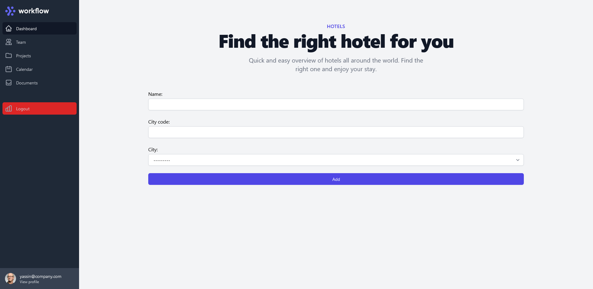

# Integrating third parties

## About
For this case we’ll make use of a common situation at Maykin Media: integrating third parties in a 
piece of software. These third parties expose data or API’s which are used in the services that we 
offer our clients.

In this case, to keep the exercise small, an application has to be built that imports CSV hotel data. Of 
course CSV data is flat, while in the case of data models in Django one wants to make use of relations.
So during the import of the data those relations have to be restored. Then in the end a small frontend application has to be built that allows users to lookup hotel data.

<div style="text-align:center">
    
    
    
    
    
    
    
    
</div>

## Requirements
* Python V3.+
* Latest Django version


## Installation

```
git clone https://github.com/YassinAO/integrating_third_parties
cd integrating_third_parties
pip install pipenv 
pipenv shell
cd integrating_third_parties
pip install -r requirements.txt
npm install
copy .env-boilerplate .env
```
#### **Make sure to change the credentials in the .env file to fit your needs.**

Once you have the database up and running, use the following commands:
```
python manage.py makemigrations
python manage.py migrate
```

To populate the database you need to set the credentials and urls in the .env file that lead to the authenticated http.<br/>
After doing that you can make use of the following command
```
python manage.py import_csv
```
This command above can also be executed automatically by using Windows task scheduler, see tutorial below on how to do this:<br/>
[Schedule Django commands with Windows task scheduler (2021)](https://www.youtube.com/watch?v=2UbJfx-cHb4)

To run the server use the command:
```
python manage.py runserver
```

**NOTE:** 
Users have their default location set to Amsterdam, you can change this in the admin panel. <br>
If the auth user is a manager/staff they will be able to manipulate hotel data that are located in their base location.
You can change a users permissions in the admin panel as superuser.